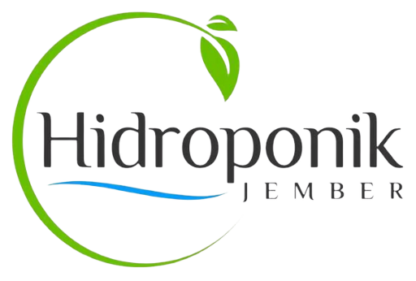

<p align="center">
    
</p>

# AgroMart - Hidroponik Jember

**AgroMart** adalah sebuah platform berbasis web yang dirancang untuk mendukung pengelolaan dan penjualan produk hidroponik di Jember. Website ini menyediakan fitur-fitur seperti:

- **Dashboard Interaktif**: Menampilkan data penjualan, status pesanan, dan informasi penting lainnya.
- **Manajemen Produk**: Mengelola produk hidroponik dengan mudah.
- **Laporan Keuangan**: Menyediakan laporan pendapatan, pengeluaran, dan laba bersih.
- **Pesanan Baru**: Melacak pesanan pelanggan secara real-time.

Website ini bertujuan untuk membantu pelaku usaha hidroponik dalam meningkatkan efisiensi operasional dan memperluas jangkauan pasar.

---

## Fitur Utama

- **Dashboard Penjualan**: Menampilkan produk dengan penjualan terbanyak dan status pesanan.
- **Manajemen Produk**: Tambah, edit, dan hapus produk dengan mudah.
- **Laporan Keuangan**: Pantau pendapatan, pengeluaran, dan laba bersih.
- **Pesanan Baru**: Kelola pesanan pelanggan secara efisien.

---

## Teknologi yang Digunakan

- **Laravel**: Framework PHP untuk pengembangan aplikasi web.
- **Tailwind CSS**: Framework CSS untuk desain responsif dan modern.
- **MySQL**: Basis data untuk menyimpan informasi produk, pesanan, dan laporan keuangan.
- **Chart.js**: Untuk menampilkan grafik penjualan secara interaktif.

---

## Cara Menjalankan Proyek

1. Clone repository ini:
   ```bash
   git clone https://github.com/username/agromart.git
